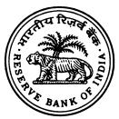

#### भारतीय ǐरज़व [ बɇक **-----------------RESERVE BANK OF INDIA----------------- www.rbi.org.in**

RBI/2012-13/559 RPCD. GSSD. CO. No 81 / 09.01.03/2012-13 June 27, 2013 

The Chairman/ Managing Director All Scheduled Commercial Banks Including Regional Rural Banks

Dear Sir,

## **Priority Sector Lending- Restructuring of SGSY as National Rural Livelihood Mission (NRLM) - Aajeevika**

Please refer to The [Master Circular RPCD. GSSD. BC. No.1/09.01.01/2012 – 13](http://rbi.org.in/scripts/BS_ViewMasCirculardetails.aspx?id=7383)  [dated July 2, 2012](http://rbi.org.in/scripts/BS_ViewMasCirculardetails.aspx?id=7383) on Priority Sector Lending- Special Programmes - Swarnajayanti Gram Swarozgar Yojana (SGSY).

## **1. Background**

1.1. The Ministry of Rural Development, Government of India has launched National Rural Livelihood Mission (NRLM) by restructuring Swarnajayanti Gram Swarozgar Yojana (SGSY) replacing the existing SGSY scheme, effective from April 1, 2013.

1.2. NRLM is the flagship program of Govt. of India for promoting poverty reduction through building strong institutions of the poor, particularly women, and enabling these institutions to access a range of financial services and livelihoods services. NRLM is designed to be a highly intensive program and focuses on intensive

मामीण आयोजना और ऋण ǒवभाग,कɅिȣय काया[लय, 10वीं मंǔज़ल,कɅिȣय काया[लय ǒबǔãडंग,शहȣद भगत िसंह माग,[पो.बा.सं.10014,मुंबई 400 001 टेलीफोन:Tel No.: 022-22610261/ फैÈस: 022-22610943 ईमेल: audgata@rbi.org.in

Rural Planning & Credit Department,Central Office,10th Floor,Central Office Building,Shahid Bhagat Singh Marg,P.Box No.10014, Mumbai 400 001 Ǒहंदȣ आसान है, इसका ूयोग बढ़ाइए

चेतावनी **:** - मेल ǐरज़व [ बɇक Ʈारा डाक**,** एसएमएस या फोन कॉल के जǐरए Ǒकसी कȧ भी åयǒƠगत जानकारȣ जैसे बɇक के खाते का Þयौरा **,** पासवड[ आǑद नहȣं मांगी जाती है। यह धन रखने या देने का ूःताव भी नहȣं करता है। ऐसे ूः तावɉ का Ǒकसी भी तरȣके से जवाब मत दȣǔजए। **Caution: RBI never sends mails, SMSs or makes calls asking for personal information like bank account details, passwords, etc. It never keeps or offers funds to anyone. Please do not respond in any manner to such offers.**

application of human and material resources in order to mobilize the poor into functionally effective community owned institutions, promote their financial inclusion and strengthen their livelihoods. NRLM complements these institutional platforms of the poor with services that include financial and capital services, production and productivity enhancement services, technology, knowledge, skills and inputs, market linkage, etc. The commuity institutions also offer a platform for convergence and partnerships with various stakeholders by building environment for the poor to access their rights and entitlements and public service.

1.3 A women's self help group, coming together on the basis of mutual affinity is the primary building block of the NRLM community institutional design. NRLM focuses on building, nurturing and strengthening the institutions of the poor women, including the SHGs and their Federations at village and higher levels. In addition NRLM will promote livelihoods institutions of rural poor. The mission will provide a continuous hand-holding support to the institutions of poor for a period of 5 – 7 years till they come out of abject poverty. The community institutional architecture put in place under NRLM will provide support for a much longer duration and of a greater intensity.

1.4 The support from NRLM will include all round capacity building of the SHGs ensuring that the group functions effectively on all issues concerning their members, financial management, providing them with initial fund support to address vulnerabilities and high cost indebtness, formation and nurturing of SHG federations, making the federations as strong support organizations, making the livelihoods of the poor sustainable, formation and nurturing of livelihoods organizations, skill development of the rural youth to take up self enterprises or jobs in organized sector, enabling these institutions to access their entitlements from the key line departments,etc.

1.5 The implementation of NRLM is in a Mission Mode. NRLM adopts a demand driven approach, enabling the States to formulate their own State specific poverty reduction action plans. NRLM enables the State rural livelihoods missions to professionalize their human resources at State, district and block level. The State missions are capacitated to deliver a wide range of quality services to the rural poor. NRLM emphasises: continuous capacity building, imparting requisite skills and creating linkages with livelihoods opportunities for the poor, including those emerging in the organized sector, and monitoring against targets of poverty reduction outcomes. The blocks and districts in which all the components of NRLM will be implemented, either through the SRLMs or partner institutions or NGOs, will be the intensive blocks and districts, whereas remaining will be non-intensive blocks and districts. The selection of intensive districts will be done by the states based on the demographic vulnerabilities. It will be rolled out in a phased manner over the next 7 - 8 years. **All blocks in the country will become intensive blocks over time.** 

#### **2. Key difference from SGSY:**

2.1 NRLM is promoting a major shift from purely 'allocation based' strategy to a 'demand driven' strategy wherein states have the flexibility to develop their own plans for capacity building of women SHGs and Federations, infrastructure and marketing, and policy for financial assistance for the SHGs.

2.2 NRLM will identify the target group of poor through a 'participatory identification of the poor' process instead of using the BPL list as was done in SGSY. This will ensure that the voiceless, poorest of poor are not ignored. In fact under NRLM, the first preference is given to the poorest of poor households.

2.3 NRLM will promote the formation of women SHGs on the basis of **affinity** and not on the basis of a common activity, as it used to be under SGSY. It is definitely possible that members who come together on the basis of affinity could be having a common activity.

2.4 Unlike SGSY, the NRLM has taken a saturation approach and will ensure all the poor in a village are covered and a woman from each poor family is motivated to join the SHG.

3

2.5 *SHG Federations*: All SHGs in a village come together to form a federation at the village level. The village federation is a very important support structure for the members and their SHGs. The cluster federation is the next level of federation. A cluster consists of a group of villages within a block. The exact configuration will vary from State to State, but typically a cluster consists of 25 - 40 villages. The Village federations and the Cluster federations are the two critical support structures for the SHG s and their members in their long journey out of poverty.

2.6 NRLM will provide continuous hand-holding support to SHGs, and their federations. This was missing in SGSY. Under NRLM this support will be provided to a great extent by capacitating the SHG federations and by building a cadre of community professionals from among the poor women. The federations and the community professionals will be imparted the necessary skills by the mission.

2.7 The objective of NRLM is to ensure that SHG s are enabled to access repeat finance from Banks, till they attain sustainable livelihoods and decent living standards. This was missing in SGSY, where the emphasis was on one time support.

*Annexure A provides with the key features of NRLM.* 

## **3. Women SHGs and their Federations**

3.1 Women SHGs under NRLM consist of 10-15 persons. In case of special SHGs i.e. groups in the difficult areas, groups with disabled persons, and groups formed in remote tribal areas, this number may be a minimum of 5 persons.

3.2 NRLM will promote affinity based women Self –help groups.

3.3 Only for groups to be formed with Persons with disabilities, and other special categories like elders, transgenders, NRLM will have both men and women in the self-help groups.

3.4 SHG is an informal group and registration under any Societies Act, State cooperative Act or a partnership firm is not mandatory vide Circular *RPCD. No. Plan*  *BC.13/PL-09.22/90-91* dated *July 24th, 1991*. However Federations of SHGs formed at village level, cluster level, and at higher levels are to be registered under appropriate acts prevailing in their States.

#### **Financial Assistance to the SHGs**

**4 Revolving Fund (RF):** NRLM would provide a Revolving Fund (RF) support to SHGs in existence for a minimum period of 3/6 months and follow the norms of good SHGs, i.e they follow 'Panchasutra' – regular meetings, regular savings, regular internal lending, regular recoveries and maintenance of proper books of accounts. Only such SHGs that have not received any RF earlier will be provided with RF, as corpus, with a minimum of Rs. 10,000 and up to a maximum of Rs. 15,000 per SHG. The purpose of RF is to strengthen their institutional and financial management capacity and build a good credit history within the group.

#### **5. Capital Subsidy has been discontinued under NRLM:**

No Capital Subsidy will be sanctioned to any SHG from the date of implementation of NRLM.

#### **6. Community Investment support Fund (CIF)**

CIF will be provided to the SHGs in the intensive blocks, routed through the Village level/ Cluster level Federations, to be maintained in perpetuity by the Federations. The CIF will be used, by the Federations, to advance loans to the SHGs and/or to undertake the common/collective socio-economic activities.

#### **7. Introduction of Interest subvention:**

NRLM has a provision for interest subvention, to cover the difference between the Lending Rate of the banks and 7%, on all credit from the banks/ financial institutions availed by women SHGs, for a maximum of Rs 3,00,000 per SHG. This will be available across the country in two ways:

- *i.* In 150 identified districts, banks will lend to all the women SHGs @7% upto an aggregated loan amount of Rs 3,00,000/- . The SHGs will also get
additional interest subvention of 3% on prompt payment, reducing the effective rate of interest to 4%.

- *ii.* In the remaining districts also, NRLM compliant women SHGs will be registered with SRLMs. These SHGs are eligible for interest subvention to the extent of difference between the lending rates and 7% for the loan upto Rs. 3 lakhs, subjected to the norms prescribed by the respective SRLMs. This part of the scheme will be operationalized by SRLMs.
*(A separate circular will be issued regarding the detailed guideline on interest subvention and its operationalization across the country alongwith the list of 150 identified districts)* 

## **8. Role of banks –**

**8.1 Opening of Savings accounts:** The role of banks would commence with opening of accounts for all the Women SHGs, SHGs with members of Disability and the Federations of the SHGs. The 'Know Your Customer' (KYC) norms as specified from time to time by Reserve Bank of India are applicable for identification of the customers.

## **8.2 Lending Norms:**

## **8.2.1) the eligibility criteria** for the SHGs to avail loans

- SHG should be in active existence at least since the last 6 months as per the books of account of SHGs and not from the date of opening of S/B account.
- SHG should be practicing '*Panchasutras' i.e.* Regular meetings; Regular savings; Regular inter-loaning; Timely repayment; and Up-todate books of accounts;
- Qualified as per grading norms fixed by NABARD. As and when the Federations of the SHGs come to existence, the grading exercise can be done by the Federations to support the Banks.
- The existing defunct SHGs are also eligible for credit if they are revived and continue to be active for a minimum period of 3 months.

**8.2.2. Loan amount**: Emphasis is laid on the multiple doses of assistance under NRLM. This would mean assisting an SHG over a period of time, through repeat

doses of credit, to enable them to access higher amounts of credit for taking up sustainable livelihoods and improve on the quality of life. The amount of various doses of credit should be as follows:

- First dose: 4-8 times to the proposed corpus during the year or Rs. 50,000 whichever is higher.
- Second dose: 5-10 times of existing corpus and proposed saving during the next twelve months or Rs. 1 lakhs, whichever is higher.
- Third dose: Minimum of Rs. 2 lakhs, based on the Micro credit plan prepared by the SHGs and appraised by the Federations/Support agency and the previous credit history
- Fourth dose onwards: Loan amount can be between Rs. 5-10 lakhs for fourth dose and/or higher in subsequent doses. The loan amount will be based on the Micro Credit Plans of the SHGs and their members.

The loans may be used for meeting social needs, high cost debt swapping and taking up sustainable livelihoods by the individual members within the SHGs or to finance any viable common activity started by the SHGs.

*(Corpus is inclusive of revolving funds, if any, received by that SHG, its own savings and funds from other sources in case of promotion by other institutes/NGOs.)* 

## **8.3 Type of facility and repayment**:

*8.3.1* SHGs can avail either Term loan or a CCL loan or both based on the need. In case of need, additional loan can be sanctioned even though the previous loan is outstanding.

8.3.2. Repayment schedule could be as follows:

- The first dose of loan will be repaid in 6-12 instalments
- Second dose of loan will be repaid in 12-24 months.
- Third dose will be sanctioned based on the micro credit plans, the repayment has to be either monthly/quarterly /half yearly based on the cash flow and it has to be between 2 to 5 Years.

- Fourth dose onwards: repayment has to be either monthly/quarterly /half yearly based on the cash flow and it has to be between 3 to 6 Years
#### **8.4. Security and Margin:**

No collateral and no margin will be charged upto Rs. 10.00 lakhs limit to the SHGs. No lien should be marked against savings bank account of SHGs and no deposits should be insisted while sanctioning loans.

## **8.5. Dealing with Defaulters**:

*8.5.1* It is desirable that wilful defaulters should not be financed under NRLM. In case wilful defaulters are members of a group, they might be allowed to benefit from the thrift and credit activities of the group including the corpus built up with the assistance of Revolving Fund. But at the stage of assistance for economic activities, the wilful defaulters should not have the benefit of further assistance until the outstanding loans are repaid. Wilful defaulters of the group should not get benefits under the NRLM Scheme and the group may be financed excluding such defaulters while documenting the loan.

*8.5.2* Further, non-wilful defaulters should not be debarred from receiving the loan. In case of defaulters due to genuine reasons, Banks may follow the norms suggested for restructuring the account with revised repayment schedule.

# **9. Credit Target Planning**

9.1 Based on the potential linked plan/state focus paper prepared by NABARD, SLBC sub-committee may arrive at the district-wise, block-wise and branch-wise credit plan. The sub- committee has to consider the existing SHGs, New SHGs proposed, and number of SHGs eligible for fresh and repeat loans as suggested by the SRLMs to arrive at the credit targets for the states. The targets so decided should be approved in the SLBC and should be reviewed and monitored periodically for effective implementation

9.2. The district-wise credit plans should be communicated to the DCC. The Block-wise/Cluster-wise targets are to be communicated to the bank Branches through the Controllers**.** 

#### **10. Post credit follow-up**

10.1 Loan pass books in regional languages may be issued to the SHGs which may contain all the details of the loans disbursed to them and the terms and conditions applicable to the loan sanctioned. The passbook should be updated with every transaction made by the SHGs. At the time of documentation and disbursement of loan, it is advisable to clearly explain the terms and conditions as part of financial literacy

10.2 Bank branches may observe one fixed day in a fortnightly to enable the staff to go to the field and attend the meetings of the SHGs and Federations to observe the operations of the SHGs and keep a track of the regularity in the SHGs meetings and performance.

#### **11. Repayment:**

Prompt repayment of the loans is necessary to ensure the success of the programme. Banks shall take all possible measures, i.e. personal contact, organization of joint recovery camps with District Mission Management Units(DPMUs) / DRDAs to ensure the recovery of loans. Keeping in view, the importance of loan recovery, banks should prepare a list of defaulters under NRLM every month and furnish the list in the BLBC, DLCC meetings. This would ensure that NRLM staff at the district/ block level will assist the bankers in initiating the repayment.

#### **12. Deputation of the bank officials to SRLMs**

As a measure of strengthening the (DPMUs) / DRDAs and for promoting a better credit environment, deputation of the bank officials to DPMUs/ DRDAs has been suggested. Banks may consider deputing officers at various levels to the State Governments/DRDAs in consultation with them.

#### **13. Supervision and monitoring of the Scheme.**

Banks may set up NRLM cells at Regional/Zonal office. These cells should periodically monitor and review the flow of credit to the SHGs, ensure the implementation of the guidelines to the scheme, collect data from the branches and make available consolidated data to the Head office and the NRLM units at the districts/ blocks. The cell should also discuss this consolidated data in the SLBC, BLBC and DCC meetings regularly to maintain the effective communication with the state staff and all banks.

13.1 **State Level Banker's Committee:** SLBCs shall constitute a sub-committee on SHG-bank linkage. The sub-committee should consist of members from all banks operating in the State, RBI, NABARD, CEO of SRLM, representatives of State Rural Development Department, Secretary-Institutional Finance and Representatives of Development Departments etc. The sub- committee shall meet once a month with a specific agenda of review, implementation and monitoring of the SHG-Bank linkage and the issues/ constraints in achievement of the credit target. The decisions of SLBCs should be derived from the analysis of the reports of the sub-committee.

13.2 **District Coordination Committee: The DCC (NRLM sub-committee)** shall regularly monitor the flow of credit to SHGs at the district level and resolve issues that constrain the flow of credit to the SHGs at district level. This committee meeting should have participation of LDMs, AGM of NABARD, district coordinators of the banks and DPMU staff representing NRLM and office bearers of SHG federations.

13.3 **Block level Bankers Committee:** The BLBC shall meet regularly and take up issues of SHG bank linkage at the block level. In this Committee, the SHGs/ Federations of the SHGs should be included as members to raise their voice in the forum. Branch wise status of SHG credit shall be monitored at the BLBC (*Annex B and C may be used for the purpose)*

13.4 Reporting to Lead District Managers: The branches may furnish the progress report and the delinquency report achieved under various activities of NRLM in the format at Annex 'B' and 'Annex C' to the LDM every month for onward submission to Special Steering Committee/sub-committee constituted by SLBC.

13.5 Reporting to RBI: Banks may give a state-wise consolidated report on the progress made on NRLM to RBI/NABARD at monthly intervals.

13.6 Reporting on SHG-Bank linkages: NABARD shall submit monthly report on the SHG bank linkage, data for which shall flow from the CBS platform to NRLM on regular basis.

13.7 LBR returns: Existing procedure of submitting LBR returns to be continued duly furnishing the correct code.

#### **14. Data Sharing:**

Data sharing on a mutually agreed format / interval may be provided to SRLM for initiating various strategies including recovery etc. The financing banks may enter into a Memorandum of Understanding (MOU) for regular data sharing with the State Rural Livelihood Missions, through the CBS platform.

## **15. NRLM support to the bankers:**

*15.1* SRLM would develop strategic partnerships with major banks at various levels. It would invest in creating enabling conditions for both the banks and the poor for a mutually rewarding relationship.

*15.2* SRLM will assist the SHGs through imparting Financial literacy, extending counselling services on savings, credit and training on Micro-investment Planning embedded in capacity building

15.3 Improving quality of banking services to poor clients by positioning customer relationship managers (Bank Mitra)

*15.4* Leveraging IT mobile technologies and institutions of poor and youth as business facilitators and business correspondents.

*15.5*. **Community based recovery mechanism:** One exclusive sub - committee for SHG Bank Linkage may be formed at village/cluster/ block level which will provide support to the banks in ensuring proper utilization of loan amount, recovery etc. The bank linkage sub - committee members from each village level federation along with project staff will meet once in a month under the chairmanship of the Branch Manager in the branch premises with the agenda items relating to bank linkage.

#### **16. Closure of SGSY Scheme.**

*16.1* Banks may commence extending credit under NRLM replacing SGSY from 1st July 2013.

*16.2* In respect of Loans sanctioned under SGSY during 2012-13 for which subsidy is released, the banks may disburse the loan before 30th June 2013 or return the subsidy amount, if the loan is not disbursed.

*16.3* The loans sanctioned by banks on or after April 1st, 2013 will be covered under the ambit of NRLM.

*16.4* In case of part disbursal of loans, the Banks may disburse the full amount by availing the balance subsidy amount under SGSY.

*16.5* Interest subvention scheme is not applicable for the outstanding loans sanctioned under SGSY, where capital subsidy is already released.

Yours faithfully,

(R. K. Moolchandani) General Manager

Encl: As above

#### **Key Features of NRLM**

- **1. Universal Social Mobilization:** To begin with, NRLM would ensure that at least one member from each identified rural poor household, preferably a woman, is brought under the Self Help Group (SHG) network in a time bound manner. Subsequently, both women and men would be organized for addressing livelihoods issues i.e. farmers organizations, milk producers' cooperatives, weavers associations, etc. All these institutions are inclusive and no poor would be left out of them. NRLM would ensure adequate coverage of vulnerable sections of the society such that 50% of the beneficiaries are SC/STs, 15% are minorities and 3% are persons with disability, while keeping in view the ultimate target of 100% coverage of BPL families.
- **2. Participatory identification of poor (PIP):** The experience from SGSY suggests that the current BPL list has large inclusion and exclusion errors. To widen the target groups beyond the BPL list and to include all the needy poor, NRLM will undertake community based process i.e. participation of the poor process to identify its target group. Participatory process based on sound methodology and tools *(social mapping and well being categorization, deprivation indicators)* and also locally understood and accepted criterion ensures local consensus that inadvertently reduces the inclusion and exclusion errors, and enables formation of the groups on the basis of mutual affinity. Over the years, the participatory method of identifying the poor have been developed and applied successfully in the states like AP, Kerala, Tamil Nadu and Odisha.

The households identified as poor through the P.I.P process will be accepted as NRLM target group and will be eligible for all the benefits under the programme. The list finalized after PIP process will be vetted by the Gram Sabha and approved by the Gram Panchayat.

Till the PIP process is undertaken by the State in a particular district/Block, the rural households already included in the official BPL list will

13

be targeted under NRLM. As already provided in the Framework for implementation of NRLM, up to 30% of the total membership of the SHGs may be from among the population marginally above the poverty line, subject to the approval of the BPL members of the group. This 30% also includes the excluded poor, those who are really as poor as those included in BPL list but their name does not figure in the list.

- **3. Promotion of Institutions of the poor:** Strong institutions of the poor such as SHGs and their village level and higher level federations are necessary to provide space, voice and resources for the poor and for reducing their dependence on external agencies. They empower them and also act as instruments of knowledge and technology dissemination, and hubs of production, collectivization and commerce. NRLM, therefore, would focus on setting up these institutions at various levels. In addition, NRLM would promote specialized institutions like Livelihoods collectives, producers' cooperatives/companies for livelihoods promotion through deriving economies of scale, backward and forward linkages, and access to information, credit, technology, markets etc. The Livelihoods collectives would enable the poor to optimize their limited resources.
	- **4. Strengthening all existing SHGs and federations of the poor.** There are existing institutions of the poor women formed by Government efforts and efforts of NGOs. NRLM would strengthen all existing institutions of the poor in a partnership mode. The self-help promoting institutions both in the Government and in the NGO sector would promote social accountability practices to introduce greater transparency. This would be in addition to the mechanisms that would be evolved by SRLMs and state governments. The learning from one another underpins the key processes of learning in NRLM.
- **5. Emphasis on Training, Capacity building and skill building:** NRLM would ensure that the poor are provided with the requisite skills for: managing their institutions, linking up with markets, managing their existing livelihoods, enhancing their credit absorption capacity and credit worthiness, etc. A multipronged approach is envisaged for continuous capacity building of the

targeted families, SHGs, their federations, government functionaries, bankers, NGOs and other key stakeholders. Particular focus would be on developing and engaging community professionals and community resource persons for capacity building of SHGs and their federations and other collectives. NRLM would make extensive use of ICT to make knowledge dissemination and capacity building more effective.

- **6. Revolving Fund and Community investment support Fund (C.I.F):** A Revolving Fund would be provided to eligible SHGs as an incentive to inculcate the habit of thrift and accumulate their own funds towards meeting their credit needs in the long-run and immediate consumption needs in the short-run. The C.I.F would be a corpus and used for meeting the members' credit needs directly and as catalytic capital for leveraging repeat bank finance. The C.I.F would be routed to the SHGs through the Federations. The key to coming out of poverty is continuous and easy access to finance, at reasonable rates, till they accumulate their own funds in large measure.
- **7. Universal Financial Inclusion:** NRLM would work towards achieving universal financial inclusion, beyond basic banking services to all the poor households, SHGs and their federations. NRLM would work on both demand and supply side of Financial Inclusion. On the demand side, it would promote financial literacy among the poor and provides catalytic capital to the SHGs and their federations. On the supply side, it would coordinate with the financial sector and encourage use of Information, Communication & Technology (ICT) based financial technologies, business correspondents and community facilitators like 'Bank Mitras'. It would also work towards universal coverage of rural poor against loss of life, health and assets. Further, it would work on remittances, especially in areas where migration is endemic.
- **8. Provision of Interest Subvention:** The rural poor need credit at low rate of interest and in multiple doses to make their ventures economically viable. In order to ensure affordable credit, NRLM has a provision for subvention on interest rate above 7% per annum for all eligible SHGs, who have availed

loans from mainstream financial institutions. (The final guidelines on this will be released after the requisite approvals.)

- **9. Funding Pattern:** NRLM is a Centrally Sponsored Scheme and the financing of the programme would be shared between the Centre and the States in the ratio of 75:25 (90:10 in case of North Eastern States including Sikkim; completely from the Centre in case of UTs). The Central allocation earmarked for the States would broadly be distributed in relation to the incidence of poverty in the States.
	- **10. Phased Implementation:** Social capital of the poor consists of the institutions of the poor, their leaders, community professionals and more importantly community resource persons (poor women whose lives have been transformed through the support of their institutions). Building up social capital takes some time in the initial years, but it multiplies rapidly after some time. If the social capital of the poor does not play the lead role in NRLM, then it would not be a people's programme. Further, it is important to ensure that the quality and effectiveness of the interventions is not diluted. Therefore, a phased implementation approach is adopted in NRLM. NRLM would reach all districts by the end of 12th Five-year Plan.
- **11. Intensive blocks.** The blocks that are taken up for implementation of NRLM, 'intensive blocks', would have access to a full complement of trained professional staff and cover a whole range of activities of universal and intense social and financial inclusion, livelihoods, partnerships etc. However, in the remaining blocks or non-intensive blocks, the activities may be limited in scope and intensity.
- **12. Rural Self Employment Training Institutes (RSETIs).** RSETI concept is built on the model pioneered by Rural Development Self Employment Institute (RUDSETI) – a collaborative partnership between SDME Trust, Syndicate Bank and Canara Bank. The model envisages transforming unemployed youth into confident self- employed entrepreneurs through a short duration experiential learning programme followed by systematic long duration hand

holding support. The need-based training builds entrepreneurship qualities, improves self-confidence, reduces risk of failure and develops the trainees into change agents. Banks are fully involved in selection, training and post training follow up stages. The needs of the poor articulated through the institutions of the poor would guide RSETIs in preparing the participants/trainees in their pursuits of self-employment and enterprises. NRLM would encourage public sector banks to set up RSETIs in all districts of the country.

#### **Branch Name:**

#### **Bank Name:**

**Block Name: District:** 

**State:**

|          |                                                                                                                                               |                |                                             |                       |                                           |                                 |                                          |                                             |                                                     |                           | *R s la khs                                  |
|----------|-----------------------------------------------------------------------------------------------------------------------------------------------|----------------|---------------------------------------------|-----------------------|-------------------------------------------|---------------------------------|------------------------------------------|---------------------------------------------|-----------------------------------------------------|---------------------------|----------------------------------------------------|
| S. No | of SH Gs No w nts ac                                                                                                        | S /B ith |                                             |                       | Cre dit din tst ou an g |                                 |                                          |                                             |                                                     |                           |                                                    |
|          | To tal S /B till Ne /c ed ts ac co un w a op en las th thi th t m on s m on |                | Cu lat ive mu                      | Ne w l oa ns |                                           | Re Lo at pe an s |                                          | Cu lat ive mu                      |                                                     |                           |                                                    |
|          |                                                                                                                                               |                |                                             | No of loa ns | Am nt ou dis bu d* rse  | No of lo an s       | Am nt ou dis bu d* rse | No of lo an s                   | Am nt ou dis bu d* rse            | No of lo an s | Am nt ou din * tst ou an g |
|          | 1(a )                                                                                                                                      | 1( ) b   | 1( ) = c 1(a )+ 1( ) b | 2(a )              | 2( ) b                              | (a ) 3                    | ( ) 3 b                         | 4(a ) = 2( )+ (a ) 3 a | 4( b ) = 2( )+ ( ) b 3 b | (a ) 5              | ( ) 5 b                                   |
|          |                                                                                                                                               |                |                                             |                       |                                           |                                 |                                          |                                             |                                                     |                           |                                                    |
|          |                                                                                                                                               |                |                                             |                       |                                           |                                 |                                          |                                             |                                                     |                           |                                                    |
|          |                                                                                                                                               |                |                                             |                       |                                           |                                 |                                          |                                             |                                                     |                           |                                                    |
|          |                                                                                                                                               |                |                                             |                       |                                           |                                 |                                          |                                             |                                                     |                           |                                                    |

**New loans : First linkage loans to be considered as the new loans* 

**Second and third linkage to be counted under repeat finance* 

** Credit Outstanding 5(a) and 5(b) should be inclusive of the cumulative credit disbursed in the month i.e. 5(a) = 4(b) + credit outstanding till last month*

**Progress report for the month of xxxx, 20xx** 

**Annexure B** 

**Branch Name: Bank Name: Block Name: District: State:**

#### **Delinquency Report for the month of**

**____________**

*Rs

lakhs

|                  | f l N o o o a n | A t m o u n                               |                                                     |                                           |                                                                                                                                |                                 |  |
|------------------|--------------------------------------|----------------------------------------------------------|-----------------------------------------------------|-------------------------------------------|--------------------------------------------------------------------------------------------------------------------------------|---------------------------------|--|
| S L N o | t a c c o n s u | d * i t t o s a n n g u | l I r r e g a r a c u | ( ) 4 t c o n s u | l f h ( ) i D N P A 5 t t t e a s o e a c c o n s u |                                 |  |
|                  |                                      |                                                          | f N o o                                    | d O v e r u e           | f N t o o a c c o u n s                                                                       | * A t m o u n |  |
|                  |                                      |                                                          | t a c c o u n s                | * A t m o u n           |                                                                                                                                |                                 |  |
| 1                | 2                                    | 3                                                        | ( ) 4 a                                    | ( ) b 4                          | ( ) 5 a                                                                                                               | ( ) b 5                |  |
|                  |                                      |                                                          |                                                     |                                           |                                                                                                                                |                                 |  |
|                  |                                      |                                                          |                                                     |                                           |                                                                                                                                |                                 |  |
|                  |                                      |                                                          |                                                     |                                           |                                                                                                                                |                                 |  |
|                  |                                      |                                                          |                                                     |                                           |                                                                                                                                |                                 |  |
|                  |                                      |                                                          |                                                     |                                           |                                                                                                                                |                                 |  |
|                  |                                      |                                                          |                                                     |                                           |                                                                                                                                |                                 |  |