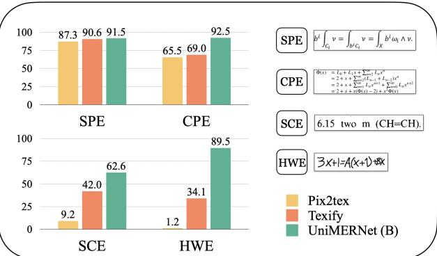

# UniMERNet: A Universal Network for Real-World Mathematical Expression Recognition

Bin Wang∗1 , Zhuangcheng Gu∗1 , Guang Liang∗1 , Chao Xu 1 , Bo Zhang 1 , Botian Shi 1 , Conghui He†

1Shanghai AI Laboratory,

#### Abstract

The paper introduces the UniMER dataset, marking the first study on Mathematical Expression Recognition (MER) targeting complex real-world scenarios. The UniMER dataset includes a large-scale training set, UniMER-1M, which offers unprecedented scale and diversity with one million training instances to train high-quality, robust models. Additionally, UniMER features a meticulously designed, diverse test set, UniMER-Test, which covers a variety of formula distributions found in real-world scenarios, providing a more comprehensive and fair evaluation. To better utilize the UniMER dataset, the paper proposes a Universal Mathematical Expression Recognition Network (UniMERNet), tailored to the characteristics of formula recognition. UniMERNet consists of a carefully designed encoder that incorporates detail-aware and local context features, and an optimized decoder for accelerated performance. Extensive experiments conducted using the UniMER-1M dataset and UniMERNet demonstrate that training on the large-scale UniMER-1M dataset can produce a more generalizable formula recognition model, significantly outperforming all previous datasets. Furthermore, the introduction of UniMERNet enhances the model's performance in formula recognition, achieving higher accuracy and speeds. All data, models, and code are available at [https:](https://github.com/opendatalab/UniMERNet) [//github.com/opendatalab/UniMERNet.](https://github.com/opendatalab/UniMERNet)

# Introduction

Mathematical Expression Recognition (MER) is a critical task in document analysis, aiming to convert image-based mathematical expressions into corresponding markup languages such as LaTeX or Markdown. MER is essential in applications like scientific document extraction, where a robust MER model helps maintain the logical coherence of documents. Unlike typical Optical Character Recognition (OCR) tasks, MER requires a deeper understanding of complex structures, including superscripts, subscripts, and various special symbols.

Existing research has primarily focused on enhancing the recognition accuracy of relatively simple rendered expressions (Deng et al. 2017) and handwritten data (Mahdavi et al. 2019; Le, Indurkhya, and Nakagawa 2019; Wu et al. 2020; Zhao et al. 2021) through a series of MER algorithms. Some

Figure 1: Performance comparison (BLEU Score) of mainstream models and UniMERNet in recognizing real-world mathematical expressions: Evaluation across Simple Printed Expressions (SPE), Complex Printed Expressions (CPE), Screen-Captured Expressions (SCE), and Handwritten Expressions (HWE).

researchers have begun to optimize MER algorithms by scaling up the training data and integrating them with transformer models (Vaswani et al. 2017), ensuring their applicability in diverse scenarios (Kim et al. 2022; Blecher 2022; Blecher et al. 2023; Paruchuri 2023). Other researchers have attempted to directly employ Large Vision-Language Models (LVLMs) for document content extraction, including MER (Wei et al. 2023; Blecher et al. 2023). However, existing MER benchmarks (Deng et al. 2017; Mahdavi et al. 2019) primarily focus on simple printed or handwritten expressions. Consequently, these models often struggle with diverse real-world expressions, such as lengthy equations and noisy scanned document screenshots.

In practice, real-world scenarios require the handling of complex, long expressions and noisy, distorted images from scanned documents or webpage screenshots. To fill this gap, we introduce a comprehensive benchmark, UniMER-Test, which extends the existing test set with longer and realworld scenario expressions. Our benchmark aims to stimulate progress in MER by focusing on robustness and practical usage. As depicted in Figure [1,](#page-0-0) we conduct exhaustive evaluations of state-of-the-art MER methods (Blecher 2022; Paruchuri 2023) using our novel benchmark, UniMER-Test. These methods demonstrate remarkable competence in rec-

*Equal contribution.

†Corresponding author (heconghui@pjlab.org.cn).

ognizing simple printed expressions. However, their performance noticeably declines when tested with more complex printed expressions, particularly long formulas. The performance degradation becomes even more pronounced when these methods are applied to real-world expressions, such as screen-captured expressions embedded in noisy backgrounds and handwritten expressions. Moreover, large vision-language models such as Nougat (Blecher et al. 2023) and Vary (Wei et al. 2023), despite their capacity for convenient end-to-end document content extraction, exhibit only mediocre performance in MER.

To train a high-quality formula recognition model capable of accurately predicting results in diverse scenarios, we have constructed the UniMER-1M dataset. This large-scale dataset is specifically designed for Mathematical Expression Recognition (MER) and includes over one million diverse formula Image-LaTeX pairs. During its construction, we considered various levels of formula complexity, ranging from simple to complex long formulas, as well as different types, including printed and handwritten formulas. This ensures the dataset's suitability for training a model that generalizes well to real-world scenarios. Furthermore, to fully leverage the UniMER dataset, we propose an innovative formula recognition model—UniMERNet. Unlike the mainstream document recognition frameworks that directly use the Swin-Transformer encoder and mBART decoder, we have optimized the model structure specifically for the formula recognition task. In the encoder, we introduce the Fine-Grained Embedding (FGE) module and the Convolutional Enhancement (CE) module for local context awareness. In the decoder, we incorporate the Squeeze Attention (SA) module to accelerate inference. These enhancements result in significant improvements in both inference speed and accuracy.

The main contributions of this paper are as follows:

- We introduce UniMER[1](#page-1-0) (He et al. 2024), a universal MER dataset, with the training set UniMER-1M and the test set UniMER-Test, which encompasses all types of expressions in practical situations, offering a diverse and comprehensive foundation for MER model development and evaluation.
- We propose a novel network structure, UniMERNet, specifically designed for the formula recognition task. By designing a more precise encoder and a faster decoder, we can freely combine models to achieve higher accuracy and faster speed in formula recognition.
- Validation of UniMERNet's superior performance through extensive experiments, establishing it as the new benchmark in open-source MER solutions by outperforming existing models in a variety of scenarios.

# Related Work

### Traditional Machine Learning Methods in MER

Decades ago, researchers recognized the importance of Mathematical Expression Recognition (MER). Anderson (Anderson 1967) pioneered MER in irregular documents by introducing a parsing algorithm for two-dimensional character configurations. Miller and Viola (Miller and Viola 1998) proposed a system integrating character segmentation with the grammar of mathematical layouts. Chan *et al.* (Chan and Yeung 1999) developed an online MER system featuring error detection and correction mechanisms. INFTY (Suzuki et al. 2003) presented an OCR system for mathematical documents that achieved high character recognition accuracy through novel techniques. However, despite these advancements, MER precision was limited by handcrafted features in traditional machine learning.

### Deep Learning and Transformer Methods in MER

With the advent of deep learning, various MER algorithms based on Convolutional Neural Networks (CNN)(Krizhevsky, Sutskever, and Hinton 2012; Simonyan and Zisserman 2015) were proposed. Deng *et al.*(Deng et al. 2017) introduced an encoder-decoder model with a coarse-to-fine attention mechanism, demonstrating superior performance over traditional OCR systems using the IM2LATEX-100K dataset. The WAP model (Zhang et al. 2017) autonomously learned mathematical grammar and symbol segmentation, aligning closely with human intuition, while the PAL-v2 model (Wu et al. 2020) used paired adversarial learning to excel in handwritten expression recognition on the CROHME dataset. Zhang *et al.*(Zhang et al. 2020) proposed a tree-structured decoder for complex markups, and Zhao *et al.*(Zhao et al. 2021) and Bian *et al.*(Bian et al. 2022) enhanced MER with bi-directional learning in encoder-decoder models, advancing Handwritten Mathematical Expression Recognition (HMER). The CAN model(Li et al. 2022) improved HMER by incorporating a weakly supervised counting module, while Le *et al.*(Le, Indurkhya, and Nakagawa 2019) and Li *et al.*(Li et al. 2020) employed data augmentation strategies to enhance MER performance.

More recently, the rapid development of Transformer models (Vaswani et al. 2017) and large vision-language models (Zhu et al. 2023; Liu et al. 2024; Dong et al. 2024; Liu et al. 2023; Wang et al. 2024; Zhang et al. 2024; Chen et al. 2024) led researchers to explore document information extraction task based on meticulously constructed evaluation benchmarks, such as DocGenome (Xia et al. 2024) and MM-Sci (Li et al. 2024). For example, Donut (Kim et al. 2022) introduced an end-to-end model that converts document images into structured outputs without relying on OCR, while Nougat (Blecher et al. 2023) utilized auto-generated imageto-markup samples to train a Transformer-based encoderdecoder model. Vary (Wei et al. 2023) offered a fine-grained multimodal model for document parsing. However, these methods often overlook the unique characteristics of mathematical expressions, leading to limitations in their MER capabilities. To address this, Pix2tex (Blecher 2022) and Texify (Paruchuri 2023) trained encoder-decoder models on rendered mathematical expressions, though they struggle with complex or noisy expressions.

In response to these challenges, the UniMERNet model proposed in this paper aims to build a robust and practical MER model that not only achieves state-of-the-art per-

1 <https://opendatalab.com/OpenDataLab/UniMER-Dataset>